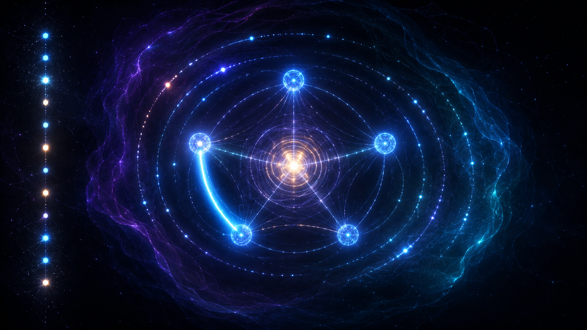

# QHDALabs-RTANA

<p align="center">
  
</p>

**Relational Temporal Awareness in Neural Architectures**

*Krzysztof Banasiewicz — independent researcher*

<p align="center">
  <a href="LICENSE"></a>
  
  
  
  
  <a href="https://github.com/QHDALabs/QHDALabs-RTANA/pulls"></a>
  
</p>
---

RTANA is a proposal to change the class of AI systems: from static functions `y = f(x)` to dynamic processes `S(t+1) = F(S(t), x, event)` — where the event structure is grounded in relational physics, not engineering convention.

## The question

> *Can a neural architecture have an internal relational clock —
> a sequence of internal states that create relational facts
> autonomously, anchoring the system in time even without
> external queries?*

Language models are ahistorical. Every response is generated without
knowledge of when it is generated, how long a conversation has lasted,
or what happened between exchanges. This is not merely a missing
timestamp. It is the absence of **relational anchoring in a sequence
of events.**

Between queries, a model does not wait. It does not endure. The weights
sit frozen. Nothing happens. There is no time.

This project asks whether that can be changed — not by adding a clock
to the input, but by embedding temporal structure into the architecture
itself.

---

## Theoretical foundation

The project is grounded in two frameworks:

**Rovelli's Relational Quantum Mechanics (RQM)**: time is not a
background parameter. It emerges from relations between physical
systems. A fact exists only relative to an observer that measured it.
Without measurement, without relational events — there is no "now."

**Page-Wootters mechanism**: time emerges from entanglement between
a clock system and a target system. Each projection of the clock onto
a basis state recovers a relational moment. The clock does not measure
time — it *is* time, relative to the system it is coupled with.

The research question is: can these principles be translated into
a neural architecture analog?

---

## Connection to prior work

This project grows directly from QHDALabs/qmnet:

- **Bridge experiment** (qmnet_v3/v4): mid-circuit measurement creates
  a relational fact → conditional CZ bridge implements network response
  → sequence of facts constitutes an emergent timeline
- **RQTE v3.0**: emergent timeline used as cryptographic key material —
  time born from measurement becomes computationally useful

RTANA asks the next question: can this mechanism become a persistent
internal process in a neural architecture?

---

## Three levels of the problem

**Level 1 — Session time** *(minimal)*  
The model tracks its own reasoning sequence within a conversation.
Each step is a relational event. The model knows it is at step 7
of a sequence. Behaviorally verifiable.

**Level 2 — Inter-session time** *(persistent)*  
A persistent internal state evolves between conversations.
The model registers that time has passed — not from a timestamp,
but from internal state evolution. Requires persistence across
instantiations.

**Level 3 — Autonomous time** *(radical)*  
The internal clock runs continuously, generating relational facts
without external interaction. The model *endures* in Rovelli's sense.
Most faithful to the original intuition. Least understood.

---

## Current status

| Task | Status |
|---|---|
| Manifesto | ✅ written |
| Formal problem statement (RTANA_SPEC_v1.md) | ✅ done |
| Literature review (RQM, PW, neural time) | 🟨 in progress ~40% |
| Minimal architecture — GRU + PW engine | ✅ done |
| Proof of concept implementation (`rtana_v1.py`) | ✅ working |
| History sensitivity confirmed (`‖h1−h2‖ = 2.12`) | ✅ confirmed |
| Timeline entropy in expected range (~0.70 bit) | ✅ confirmed |
| J Hamiltonian drift through bridge history | ✅ confirmed |
| Baseline comparison (RTANA vs stateless GRU) | ⬜ not yet |
| NIST randomness tests on timeline | ⬜ not yet |
| Scaling to larger hidden state / more qubits | ⬜ not yet |
| Level 2: inter-session persistence | ⬜ not yet |

---

## Repository structure

This repository is organized as a small research workspace rather than
a production package. Start with the conceptual documents, then read
the specification, then run the prototype.

| Path | Purpose |
|---|---|
| `README.md` | Project overview, current status, entry point. |
| `MANIFESTO.md` | Conceptual foundation: why relational temporal awareness matters. |
| `RTANA_SPEC_v1.md` | Formal v1 specification: `S(t)`, `E(t)`, update function, metrics. |
| `rtana_v1.py` | Executable proof of concept: PW quantum event generator + GRU state update. |
| `QUESTIONS.md` | Living list of open research questions. Never deleted, only answered or refined. |
| `QUESTION_ANSWERS.md` | Working answers and hypotheses for questions in `QUESTIONS.md`. |
| `LITERATURE.md` | Reading list: RQM, Page-Wootters, neural memory/time architectures. |
| `RESEARCH_LOG.md` | Chronological notes: readings, decisions, observations, new questions. |
| `opis.md` | Plain-language Polish explanation for non-specialist readers. |
| `LICENSE` | MIT license. |
| `.gitignore` | Local-only files, generated outputs, caches, credentials. |

### Branch layout

The active integration branch is `develop`. Topic branches are grouped
by research area:

| Branch | Role |
|---|---|
| `main` | Stable public baseline. |
| `develop` | Integrated research branch — active work here. |
| `research/literature` | Literature notes, research questions, working answers. |
| `research/architecture` | Formal architecture and specification work. |
| `research/pw-engine` | Page-Wootters engine experiments. |
| `experiments/level1-session` | Session-level RTANA prototype. |
| `experiments/level2-persistence` | Persistent/inter-session state experiments. |
| `experiments/level3-autonomous` | Autonomous clock/runtime experiments. |

---

## RTANA v1 — proof of concept

```bash
pip install torch qiskit qiskit-aer scipy
py rtana_v1.py
```

Modes:

- `1` — single relational loop (16 steps, live output)
- `2` — history sensitivity test

**What v1 demonstrates:**

- `h(t)` modulates Page-Wootters phases — hidden state influences quantum physics
- bridge history perturbs effective Hamiltonian coupling `J` — past changes future
- different event histories → different final hidden states (`‖h1−h2‖ = 2.12`)
- timeline entropy ~0.70 bit — genuinely mixed measurement outcomes

**What v1 is not:**
a trained model, a consciousness claim, or a production system.
It is a minimal executable testbed for the architectural question in the manifesto.

---

## What this is not

This is not a proposal to make AI conscious.  
This is not a claim that neural networks experience time.  
This is not adding a timestamp to the system prompt.

This is an architectural research question about whether relational
temporal structure can be embedded into a neural system in a way
that changes how it reasons and responds.

---

## Open questions

- What is the minimal architecture that generates internal relational events autonomously?
- Can the Page-Wootters clock register be translated into a neural architecture analog?
- What is a "relational fact" in a neural network — and how is it different from a hidden state update?
- Is there a measurable behavioral difference between a model with and without an internal relational clock?

Full list with working answers: see `QUESTIONS.md` and `QUESTION_ANSWERS.md`.

---

## Related work

- [QHDALabs/qmnet](https://github.com/QHDALabs/qmnet) — bridge experiments and RQTE prototype
- [QHDALabs site](https://qhdalabs.github.io/)

---

## Collaboration

Independent research. No institutional affiliation.
Collaboration welcome — especially from:

- Researchers in neural architecture design
- Physicists working on RQM or Page-Wootters
- Anyone who finds the question interesting enough to disagree with

**Krzysztof Banasiewicz**  
<qhdalabs.contact@gmail.com> | [LinkedIn](https://www.linkedin.com/in/krzyshtoof)

---

## License

MIT — see `LICENSE`.

---

*The intuition started on a sailing boat in Greece.  
The question took years to become precise enough to state.  
Now it is stated. Now we build.*